```mermaid

erDiagram

    CUSTOMER ||--o{ ORDER : places

    ORDER ||--|{ ORDER_ITEM : contains

    PRODUCT ||--o{ ORDER_ITEM : includes

    CUSTOMER {

        string id

        string name

        string email

    }

    ORDER {

        string id

        date orderDate

        string status

    }

    PRODUCT {

        string id

        string name

        float price

    }

    ORDER_ITEM {

        int quantity

        float price

    }

```

### Chord progression notes
- Royal road
	- IV - V - iii - vi
- Diminished Dominant Creep-up
	- I - bii(dim) - ii - V7
	- (more broadly, to bridge any two chords a whole step apart)
- Lonely heart
	- I - bVI(7) - IV
- Get to the FOUR (aka 'minor v variations')
	- I | III7 | | vi | v - I7| IV
	- IV | III | vi | v - I7 |
	- ALSO add a passing bvi between vi and v
- Line cliche
	- vi - bVI+ - I 6/4 - \#iv^o - IV
- Transition1
	- I - bIII - IV - V---
- Tritone subs
- Using parallel modes for mode mixture
---
### BG3 on long rest
- cleric stuff
- respec laezel
- dole out elixirs - 
	- (cloud) giants elixer for rogue and barb
	- crit elixir for others?
---
### Yuki Practice Talk Notes (1/20)
- General
	- asdf
- Slides
	- 1 - asdf
	- 2 - asdf
---
### Yuki Practice Talk 1 Notes (1/14)
- General
	- current version talks more about chemistry than the previous version, which is great
	- you're often a little slow to get to the point (the beginnings of the slides sometimes feel meandering and unclear)
- title
1) {we have a talented team}
2) {engines can get too hot which limits their utility}
	1) A little slow to getting to the point and clarify why we're introducing these subjects
	2) unclear why we're talking about the two different engines...and the right side of the screen
3) {metal carbides are good materials for thermal protection}
	1) how does a thermal protection system work?  why does the temperature sensitive substrate not get hot too?  how thick of a layer do you need to protect it?
4) {slide skipped around here?}
5) {carbides are generally good and B4C and SiC are especially good}
6) {existing coating application methods carry technical challenges}
	1) "back to our topic" I do like that you have the big picture in mind verbally, but the transition could probably better facilitate this flow
	2) have the image associated with the second point appear with the bullet point appearance
	3) "long turnaround" is a little long to get to the point
7) {photothermal techniques circumvent traditional challenges}
	1) Qs: various on the photothermal figure, where did you get this data?  how do you know this is true?
8) {no field maintenance}
	1) I would have the bullet point fade-in with the slide transition so it's visually clear why the other stuff disappeared 
	2) Qs: 
		1) how portable is it if you can't do it in air; 
		2) where do these parts get disassembled?  won't they need to be disassembled for parts like engines where the heat is on the inside anyway?
9) (skip?)
10) {Precursor candidates}
	1) I'd change the slide title to something like "there are two current attractive categories of carbide pre-cursor candidates" (maybe shorten that)
11) {PCD is good for B4C}
	1) will you talk about the spin coating if they question how you'll interpret results across a varied surface?  How will you delineate thickness effects from polymer synthesis or laser parameter effects?
	2) what was the comment about "risk of explosion" with oxygen?
	3) I feel that the content here meanders between why preceramic polymers are good and why PCD specifically is good.  Try to delineate/clarify them better
12) {laser processing and parameter overview}
	1) Qs
		1) why Ar and not cheaper N2?
		2) that beam looks a lot bigger than 100 um
		3) do you know what the symbols mean in the figure?
13) {XRD and SEM support generation of B4C}
	1) what about the SEM is helpful in this determination?  What about the SiC peak (?) is useful here?  How can you tell that this is B4C?  What do these peaks at these positions mean?
14) {objective 1: test environment}
	1) I think you did a good job setting up the problem with the window where the hot surface is vulnerable to oxidation, though I would not show such a complex/busy figure as the photothermal mechanism unless it is necessary (a little starburst icon to represent a laser would likely suffice here)
15) {math shows oxygen collision events happen on comparable timescale to thermal window}
	1) check that the m2 to cm2 conversion happened
	2) how do you know the thermal decay happens at this rate? source? 
16) {despite math, oxidation is visible in XRD}
	1) how do you interpret this XRD
17) {sources show B4C (?) can oxidize below 800 C}
	1) Are you talking about he precursor?  I don't think anyone doubted that oxidation of a precursor possible, so it's weird to say after you show that it oxidizes that someone else showed that it oxidized.  That was the premise of the experiment in the first place, right?
	2) if you're actually talking about B4C, then how is this material a high temperature ceramic if it oxidizes at such low temperatures?
18) {spectroscopy and pyrometry can something something (find if B4C is an intermediate?)}
	1) ?
19) {time something}
20) skipping thermometry for time
21) {objective 1 (?): surface oxygen something something}
	1) this slide was very short, I didn't really understand it
	2) didn't we already have an objective 1? did we ever have an objective 2 actually?
22) {objective 2: substrates}
	1) what is up with the XRD here?  What is is it showing in support of this slide's point?
	2) why is sapphire's TC such a wide range?  And why can silica have a TC of 0?  What influences these ranges?  Why sapphire, not something with even higher TC like graphite or metal?  is there some disadvantage to high TC?
23) {we made it on sapphire}
	1) what was up with "objective 1"?  why are we showing data for 2 but not for 1?
24) {objective 3: laser fluence on crystallinity}
	1) why do you think laser fluence specifically would influence B4C crystallinity specifically...and why do you care about crystallinity in particular to begin with?
	2) show a visual for this scan rate stuff.  it will be difficult to understand the difference between your three different parameters
25) {laser power improves crystallinity}
	1) why did you stop at 400 uJ?  difference between energy and power?
	2) slide went by super fast, careful not to rush
26) {future work for objective 3}
	1) is "objective 1" not just future work?
	2) change title to be more helpful at grounding the viewer to the slide's purpose
27) {future work: optimize precursor thickness}
	1) Qs: 
		1) what does it mean to be "too thin"?  what's bad about it?
			1) won't there be a gradient of properties either way?  if anything, wouldn't you want the thinnest possible film to make the least severe possible thermal (and property) gradient
		2) is it bad for the precursor to be unreacted?  won't the reacted material still accomplish your goal? or won't it?
---
### Yuki slides notes
- General
	- asdf
0) I would still slightly prefer the motivation first (slide 2)
1) not clear if there is a problem/gap quite yet (presumably you'll talk about it)
2) generally a clear slide, but bear in mind, like I said before, that if you haven't talked about proper chemistry (invoking papers, crystal structures, electronic states, etc.) for a few slides, they may grow antsy to push questions onto you.  One avenue of questioning I could see here is: why do 'early transition metal' carbides share these properties?  How can you tell from looking at the composition of a material what it's properties are going to be? Are all carbides ceramics?  How can you tell if a metal-containing material will be metallic or ceramic or something else?
3) generally looks good, but be prepared to answer questions about four digit Miller indices.  Also "extreme" energy is the kind of ambiguous phrasing that may invite questions about specifics.  What context do you know that qualifies 4.6 eV as "extreme"?  How much bond energy is there in some other more ordinary, non-"extreme" bonds?
4) small style issues: inconsistent capitalization, strange to bring rightmost image first, "no-field" hyphenation, add a black outline to the square images
5) an image of a substrate being destroyed or otherwise some practical example (e.g., "you just can't use something like lead or glass which suffers thermal damage at the temperatures you NEED for this transformation to work if you use an oven")
	1) also, be sure you can respond to questions about all that nanoparticle stuff (what is electron-phonon scattering?  does the electric field pull that far away from the nucleus?  they probably won't be happy with any answer like "I don't know, I didn't make the image" because you chose to use the image and so you're responsible for being able to communicate anything confusing about it)
6) just similar style comments to slide 5
7) this seems re-used from the slide 5, so I don't know how it demonstrates, communicates, or evidences any claim about using lasers, but presumably you'll be able to talk about it
8) maybe a better slide title would allude that these are just the first good candidates that came to mind.  I'd otherwise worry that you'd invite questions about if these are the most optimal possible precursors.  Either way I suppose you'll need to be prepared to briefly discuss why these specifically are good ideas.  (the nightmare scenario is that one of your committee members can think of a better candidate off the top of their heads and you can't at least discuss the reasons why it's good or bad)
9) "the optimal" feels bold enough to invite criticism.  To make any commentary on it being good relative to other possible precursors, you would want to be able to mention what specific other precursors you know and why they are indisputably worse than PCD.  So something like "an attractive candidate" would be preferred in my opinion.  
10) at this slide, I might question the cost-effectiveness of this method compared to the way that we currently apply ceramic coatings if we need to keep it in a vacuum
	1) someone might also wonder from the video why the spot 'looks' so much bigger than the 100 um diameter in the label
11) I'd prefer a slide title phrase more like "Laser processing of PCD into B4C was supported by XRD and SEM"
12) Do you know what assumptions went into Ben's 10 ns number?  I wouldn't be surprised if it was a very rough estimate, and even if it wasn't, I might expect you to be able to discuss how you know the temperature vs time decay will be so sharp...without math or a paper citation, how do you know it wouldn't take 500 ns or 5 seconds or 5 minutes?
13) how do sites/cm2 /m3 cancel to nanoseconds?
14) the paper citation is weird.  are there authors?
	1) also maybe this would make sense to show before the calculation you made to say "one possibility is that it will simply oxidize, which we know *from literature* happens between 500 and 800 C" and then "but here, *the math* shows that the rapid nature of the heat may actually outpace the collisions with O2 at the surface"... "so we collected *this data* which shows thermal dissipation is still not quite rapid enough to mitigate oxidation in air"
	2) also style: different fonts in the slide title
15) asdf
16) asdf

17) I'd modify the phrasing of the slide title to something like "Spectroscopy and pyrometry may help inform reaction dynamics"
	1) the slide contents in general are confusing to me: pump-probe spectroscopy could be interesting (though I don't understand why you want to use it here), and it's ok to propose experiments that you don't follow through on, but can you discuss it in depth?  How it works, and most importantly what specific data you expect to get?  Is there something about the 'reaction dynamics' of B4C formation that isn't known but is important for you to know?  How specifically will it help you?
	2) I also don't know what the first reference has to do with this slide
	3) I also don't know what the graphs are.  What "collision time" are we talking about?  Why is it abbreviated to "CW"?  Like "collision window"?
18) This 'scenario 1' slide confuses me as well.  Are you suggesting on this slide that the B4C is being formed and then oxidizing?  How is it an ultra-high temperature ceramic if it oxidizes at these temperatures?  And "wrong thermal window" and "wrong collision time" are difficult phrases to understand your meaning.  I still don't know what collision time means here, but do the phrases mean "what it looks like when the collision time is too long" and "what it looks like when the heat diffuses too slowly"
	1) if we're talking about the 17 ns from the "objective 1" slide, does it really matter if a single oxygen molecule collides with a cm^2 surface? When we're comparing it to 10^15 "sites," wouldn't even 1000 collisions be almost indistinguishable from 0 collisions?
19)  I'd change the slide title to something like "Nanosecond thermometry is difficult with conventional instrumentation"
	1) I still don't know that it's a good idea for you to include this in your comps, but I will be sure to bring questions for you.  An obvious one that I bet they will ask is, why specifically can you not use any of the several existing types of thermometers to accomplish this?  What's wrong with a thermocouple?  What's wrong with a $50 pyrometer for Amazon?  Or a $1000 pyrometer from oan analytical chemistry store?  They'll expect specifics
20) Setting aside my confusion ver the content of these last few slides, I do think I like the 'objective' -> 'scenario' structure you are using.  "I want to know something, here are the tests I plan on doing, here are my hypotheses for what I'll find" is a good, easily-followed flow.  But I'll have to listen to the practice talk to see if I will be able to understand the logic.
21) I think I see the point of everything on this slide.  Nice!  My criticisms are all minor: I think you mean "gradients" (not "gradience"), keep the capitalization consistent, vertically center the values in the table and make them waste less space, include the unit for thermal conductivity, and is "coefficient" a typo as well?  I usually just see it as "thermal conductivity."  And I like the idea of having the measuring tape art over just having the words "measurement interference", but depending on what you mean, there's probably a better image.  If you mean like how glass messes with Tainara's XRD, I'd maybe suggest a side-view of a thin film on a slide...then a photon entering the thin film an angle from the top and bouncing off the top of the slide instead of the top of the film
22) Are you sure that SiC line in your XRD from the previous slide is truly a peak?  I thought that SiC line was drawn to show the opposite: that there is no discernable SiC signal at the position you would expect to see it if any SiC appeared. I know Tainara said that the glass messes with her XRD measurements, but I'm not seeing the problem in the previous slide's XRD figure
23) I still feel that "explore if a condition matters" is weak language to use discussing these experiments.  A little better would be "explore the influence of laser conditions on B4C formation", but that's still too vague.  The question I would have is "what do we even care about anymore.  You told me you cared about making B4C, but then you made B4C, so what's the new goal?  Why are you still running experiments after you found what you were looking for?"  Which is to say, I would recommend updating your research goal more explicitly here.  Maybe "optimizing B4C" is a start, but then what are you optimizing for?  Material properties?  The hardest, strongest, blackest, smoothest B4C you can make?  Once I understand your goal, I'll be more curious about how you plan on achieving that, and what/why laser parameters may be a good starting place
24) probably reword to "improves B4C crystallinity."  And be careful not to confuse power with energy (you show energy units but use the word "power).  And maybe when you're speaking, explicitly include that the only parameter changed here is the power
25) this slide can work if you navigate it carefully.  First of all, are you able to respond to questions about why 'frequency' would matter here?  Like, could you speculate on what would happen at a high frequency that would make the pulse more penetrating or intense?
	1) also, why does it look like "frequency" is replacing "area" in your math?
	2) also, be prepared to respond to questions about the differences you'd expect scanning a beam over the whole area versus pulsing a more powerful beam a single time if you're going to define fluence in this way which they may find strange
26) This slide is generally really awesome (easy to follow visuals and an easy to understand problem that isn't overly obvious).  That said, I don't know that I understand what you're suggesting the consequence is for "too thin" of a coating.  I can see how having unreacted precursor could be bad, but "too thin" isn't clear to me as a problem here.
27) same as with PCD, I'd probably just want to hear why these are the precursors you'd lean towards specifically.
28) I assume this slide is just a placeholder, but if not, it's weird to introduce the other precursors and then jump back into real data being collected for the precursor you had been using the rest of the talk.
	1) also, I'm sure your committee would be happy if you understood the mechanism well, or could at least discuss the leading theory for the mechanism, but it's not a given that any piece of information is useful.  I would suggest mentioning explicitly that (1) it's not clear what the mechanism is, (2) other people may have it wrong, (3) why we think that, (4)  that this knowledge affects the design of this and other PCDs, perhaps specifically in the context of photothermal transformations
29) I'd avoid words like "prove" in favor of "suggests" or "shows"
30) 'Mechanism' may be the strongest place to have a literature background.  It would be embarrassing if the committee speculated on a possible mechanism and you couldn't discuss it.  Just remember that if you're going to include multiple slides of figures about determining the mechanism, then you'll be held responsible for understanding how those figures help (what they suggest, what they rule out, why that's important)

also 14 - why am I supposing we have 10^15 sites/cm^2?

---
Vivian idea - use like a cymbal sample on a dummy peak controller track to control sampler parameters
---
### ML notes/terms
- Early fundamental discoveries
	- 1763 - Bayes posthumously publishes "An Essay Towards Solving a Problem in the Doctrine of Chances"
	- 1812 - Laplace publishes what is now called Bayes' theorem
	- 1913 - Markov chains
- 1940s
	- Donald Hebb publishes his theory of biological neuron behavior - "Neurons that fire together, wire together"
	- Warren McCulloch and Walter Pitts propose computational modeling of neurons
- 1950s
	- Alan Turing publishes "Computing Machinery and Intelligence" paper, considering how to evaluate machine "thought" and proposing the Turing Test and Imitation Game
	- Arthur Samuel uses ML to play checkers
	- Frank Rosenblatt invents the perceptron
- 1960s
	- "learning machines" modeled on neurons are developed using punch-tape memory ("Cybertron") developed by Raytheon Company
	- Nils Nilsson publishes "Learning Machines," using machines to classify patterns
	- Alexey Ivakhenko trains a "deep network" with hidden layers and a narrowing architecture
	- a primitive backpropagation emerges and proceeds to be left in a box for 20 years
- 1970s
	- 'AI winter' of pessimism about machine learning effectiveness
	- Early 'convolutional' networks
	- backpropagation is improved in Linnainmaa in a master's thesis, but with no proposed relationship with neural networks and it is forgotten again
- 1980s
	- backpropagation re-discovered, but for real this time, applied to NN by Rumelhart, Hinton, and Williams 
	- Stevo Bozinovski reports his training methods for a network that recognized 40 handwritten characters (26 letters, 10 digits, 4 special symbols) from a computer (demo [YT video](https://youtu.be/FwFduRA_L6Q))
- 1990s
	- recurrent neural networks (RNNs) and support-vector machines (SVMs) become popular
- 2000s
	- kernel methods (SVC, etc.) and unsupervised methods become widespread
- 2010s
	- deep learning becomes "feasible", then integral to many software services and applications, spurring huge advances in vision and text processing
- 2020s
	- generative AI: advanced chatbots and text-to-image models
- exploration-exploitation dilemma - search for optimal balance between new actions and using current knowledge
- gradient descent -> stochastic gradient descent -> adaptive moment estimation
- layer-by-layer pretraining - initializing a model with suitable features (weights)
- cross-entropy
- reinforcement learning
- supervised/unsupervised learning
- evolutionary algorithms: (1) evolutionary strategies, (2) evolutionary programming, and (3) genetic algorithms
- genetic algorithm
- depth and composition - distinguishing feature of NNs over GLMs which arise from hidden layers
- clustering
- Bayes
- Markov decision process and Markov chain
- full-batch vs mini-batch gradient descent (Sebastian Lague ~22:00)
- perceptron - an algorithm for supervised learning of binary classifiers
	- classifier (binary, linear)
	- predictor function
	- feature vector
	- criticized in the 90s as being structurally-identical to a generalized linear model of statistics (GLM framework published in 1972,  [wiki](https://en.wikipedia.org/wiki/Generalized_linear_model))
		- weights -> coefficients
		- bias -> intercept
		- activation function -> link function
		- training -> maximum likelihood estimation
- autoencoder
- misc
	- (1995) Gartner hype cycle - [wiki](https://en.wikipedia.org/wiki/Gartner_hype_cycle)
	- optimal control - [wiki](https://en.wikipedia.org/wiki/Optimal_control)
---
### BG3 easy run achievements
- Act 0
	- [x] Defeat Commander Zhalk on the nautiloid
- Anytime
	- [x] kill a character with an unarmed strike
	- multiclass into every class (no withers) (JUST BUY A MERCENARY AT LEVEL 12)
	- long rest with only alcohol
	- earn 100 g from playing music
	- defeat 20 opponents drunk
- Act II
	- Kill the Surgeon before surgery
- Act III
	- knock dragon out of the sky in wyrmway
	- 
---
### BG3 minmaxing
- daily routine
	- camp party spells
		- Cleric
			- Poison resistance (x2)
			- Warding bond (x1)
		- Ranger
			- Longstrider (ritual)
		- Wizard
			- Warding Bond
			- Death Ward
			- Freedom of Movement
			- Aid
		- Misc (self? don't have?)
			- Speak with Dead
			- Detect Thoughts
			- See Invisibility
			- Elixers (Hill Giants, etc.)
	- traveling party spells
		- summon familiar/mage hand
		- summon hexblade or pact weapon
		- (remember toggle ranged)
- remember
	- str club + titanstring on ranger
---
### BG3 barbarian act 2 items
- coldbrim hat at moonrise (access to balthazar's room, ~16:30)
---
### Neural Net Demo - 2D Racing Game Outline
- Make  track
	- procedural from spline
- Make car + controller and test with player controls
	- inertial (acceleration, deceleration, turn-rate)
- Illustrate 'vision'
	- raytrace collision hits in 3-5 directions from driver's seat
- create lose condition
	- collision with walls
- debugging/QoL tools
	- UI with timer + node activation leading to the direction being pressed
- AI
	- creating node structure + initial guesses
	- evaluating cost
	- visualizing ghost racers through the learning process
	- employing a 'best of generation' pruning technique?  What are the options here?
---
### BG3 tips
- bypass the launcher by right-clicking the game name in your library, selecting Properties>General and putting "--skip-launcher" (without quotes) in Launch Options
- lots of rewarded curiosity: 
	- spells like disguise self and speak with animals (e.g., disguise self --> speak with dead)
	- alternative paths (jumping, breakable/illusory walls, holes)
		- use bludgeoning on breakable walls
- vendor discounts based on charisma of character that initiates conversation
- re-spec at a relatively small price becomes available after a few hours
- hotkeys
	- 'Left-Alt' highlights on-screen items
	- 'T' while hovering over a mob inspects them
	- shift+C to hide all
- "\*" means it hasn't been looted yet
- some important differences from DnD
	- casters can swap prepared spells any time outside of combat
	- multi-classed wizards can learn spells from scrolls up to their total spellcasting level (as opposed to wizard level)
- lots of things like traps and switches can be triggered by shooting them from a distance
- keep a shovel on a character
- click and drag can move things around or move things on top of each other (opening paths, creating climbable stacks, blocking LoS, etc.)
	- e.g., have characters carry around crates to reliably start fights with height this way
- some spells let you re-cast for free, but sometimes it creates a new button the right side for that action
- can toggle to non-lethal attacks (but only works on melee)
- de-facto teleport companions to your side out of combat by fast traveling to and from camp (useful if you have more mobility than they do to e.g., jump to a ledge)
- instead of drinking potions, drop them and then throw to shatter on the ground and apply to all characters in range
	- also works on negative/damaging potions and enemies, but all potions used this way work on everyone they hit
	- similarly with dipping weapons for a coating (poisons etc.,)...also works with candles for fire coating
- vendor cash-on-hand and inventories refresh after some number of long rests
- don't knock enemies into the abyss if you intend to loot them
- ungrouped/unseen characters can operate outside the turn-based combat until they join with an attack or become visible to enemies 
- Inventory management
	- click an armor slot to shot all the items that can go on the slot from global inventory
	- shift+click and ctrl+click to select multiple
	- drag items onto character portrait to give it to them
	- send all camping supplies straight to camp (only place they're needed)
---
### CUI Notes
- dcsa.mil [link](https://securityawareness.dcsa.mil/cui/story.html) (32 ~1 min video slides with occasional questions)
- Controlled Unclassified Information - from 2010 executive order
- 'for official use only' (FOUO) designation is deprecated
- knowledge objectives
	- purpose and location of ISOO and DOD CUI registries
	- decontrol, safeguarding, destruction
	- identify/report security incidents
- (4) no audio
- unclassified information is only CUI if there is a law/policy prescribing safeguarding or dissemination control
	- agencies must not disseminate CUI because of FOIA
- The 'authorized holder' is responsible for determining if info is CUI and marking it as such
- NDA is optional (according to CUI Notice 2020-03), but the Secretary of Defense has directed the issuance of a DOD CUI NDA
- (9) all government, civilian, and contractors must take the ISOO Registry assessment
- (11) Marking requirements
	- CUI Basic - policy does not set handling controls, so default to the registry guidelines
	- CUI Specified (SP) - specific to the information with rules set by the policy
		- don't use any abbreviation that uses SP to avoid confusion with this
- (12) marking CUI documents
	- make sure it is actually CUI
	- add a header and footer saying "CUI" 
	- add "designation indicator" (controlled by; categories; control types; POC) to the first page or cover of all documents
- (13) portion markings (not required) - U (unclassified) vs CUI
- (14) Limited Dissemination Controls (LDC) - part of designation indicator showing how it can be disseminated
- (18) when portions of a document are CUI but other portions are higher classification, the banner text of the document will read the highest level classification applicable (e.g., top secret)
- (19) mark CUI in the banner and footer of emails (use portion markers as applicable, i.e., for 'co-mingled' documents)
	- to ask more questions about markings, contact the Security Manager or Component Program Manager
- (21) no audio
	- decontrol of CUI documents will occur when the contents no longer require safeguarding
	- agencies must "promptly" decontrol CUI and notify all holders when doing so, who will then remove their CUI markings
- (22) pre-publication review required
	- see DoD instruction 5230.09 and DoD instruction 5230.29
- (24) keep CUI documents in locked containers unless the building itself has security measures against unauthorized readers
- (25) for information systems, the network configuration is "moderate confidentiality" (NIST 800-171 for non-federal systems, NIST 800-53 for federal)
- (26) CUI can be distributed through mail or online (online requires TLS) 
	- don't fax unless the sender knows the receiver is ready to intercept it or it's going to a secured location
- (27) destroying CUI
	- first process through the Records Management procedures
	- make it unreadable and irrecoverable (guidance provided in DoDM 5200.01-V3)
- (28) who can access CUI
	- not need-to-know (NTK) like classified
	- basically anyone who isn't restricted by a law/policy/LDC (limited dissemination control) and means to further any 'lawful government purpose', though agencies can place more limits found in Table 2 of DoDI 5200.48
	- might be that raw data is kept CUI until it is worked up to determine if it is really CUI
- (30) security incidents (unauthorized disclosure (UD))
	- improper marking or otherwise risking unauthorized disclosure
	- when it happens, no formal security inquiry is necessary unless disciplinary action will be taken
	- UD of some CUI, like export-controlled technical data, may result in civil and criminal sanctions
	- report mishandling to the UD Program Management office (PMO) and the Military Department Counterintelligence (CI) organization

---
### Singing warmup addition idea
- include snippets of example songs to rehearse in singing warmup with the 53ana expression list
- give the snippets multiple tags and try to find as many combinations as possible 
---
### Harry Hologram Ideas
- Pepper's Ghost (~$20, [wiki](https://en.wikipedia.org/wiki/Pepper%27s_ghost), [example video](https://youtu.be/lPvHifetWe8))
	- have display components, just need case (housing + acrylic reflector)
- Persistence of Vision (LED wands/fans)
- Ultrasonic mister + projector
---
### Samples website notes
- combine articulation and expressiveness (some overlap, e.g., ethereal)
- check the 'syncopated' tracks are really syncopated (e.g., Blinding Lights) 
---
Columbo
- don't be so Cincinnati
12 Angry Men
- it's a very sad thing to mean nothing

---
### Now You See Me 1
- diagonal windows
- why not just use a plant for the bank?
- how'd they get the audience bank details
- why frame morgan freeman
- magic cards
- why steal the vault after
---
### Public Home WiFi Risks
- clients probably not from each other, so anyone can
	- see what devices are online
	- probe them for open ports
	- attempt to connect to shared folders or IoT devices, possibly exploiting unpatched services (chromecast APIs, IoT cameras, etc.)
- Man-in-the-Middle Attacks
	- intercept unencrypted traffic, injecting malicious content into webpages
	- redirect DNS to fake login portals and phishing sites
	- duplicate the network name (evil twin attack) and silently route the traffic through their device
	- Even HTTPS encrypted traffic allow actors to track which sites you visit, attempt SSL stripping, harvest metadata, and manipulate captive portal redirects
- DNS manipulation (if the bar's DNS is compromised)
	- DNS hijacking - send you malicious versions of the sites
	- DNS logging - tracking domain lookups
- Captive Portals (Forced Traffic Injection)
	- ?
- Router admin likely has high control and visibility
	- may enforce bandwidth throttling, block ports, track devices
	- may have firewall settings to block gaming ports, VPN protocols, etc.
- IOT devices in general
	- usually unencrypted, broadcast their existence automatically, assume the network is trusted, and do not require authentication (including things like cameras)
- Not to mention
	- speed throttling/congestion, disconnects, latency, device limits
- Possible security solutions
	- travel router / firewall box - creates a private LAN behind a trusted firewall
	- 24/7 use of full-tunnel VPN - mitigate MITM, DNS hijacking, local packet sniffing
	- disable UPnP, DLNS, printer sharing, file sharing

### Tim's Texting Plan Notes
- FCC's Political Robocalls/Robotexts Rules ([link](https://www.fcc.gov/rules-political-campaign-calls-and-texts?utm))
- Messagedesk SMS / TCPA Text Message Compliance Checklist ([link](https://www.messagedesk.com/blog/tcpa-compliance))
- Thoughts
	- Does Tim have records of explicit consent/opt-in
	- Is there an easy way to do automate "respond x to opt out" and when is that good enough, rather than asking to opt in?  Is a response that isn't an opt-out considered an opt-in?
	- Texting from software (Google Voice, etc.)
	- Automating RSVP sends and consolidating responses
		- RSVPify/Partiful/Evant vs Google Form vs Mobilize (do any have CSV download?)
---
### ESP32 DMX lingering thoughts
- fix and style UI
	- XY pad
	- liquid glass attempt
	- is it broken or waiting for a connection?  or maybe requires a library?
		- maybe solve by having it connect to my phone's hotspot?
		- ask AI about intense libraries like 3js (1) how much space they would take up in the filesystem and (2) how taxing they would be on an ordinary mobile device and (3) how simple it would be to simply disable them by default with an easy to find "improved graphics" button 
	- apply this simple-looking breathing pattern [codepen](https://codepen.io/VoXelo/pen/myVpoLm)
	- use this style background and buttons/animations [codepen](https://codepen.io/tofjadesign/pen/pvgPdvy)
- Did I buy extra I2C (I2S?) 3.5 mm stereo DAC boards? Can esp32 store sufficient samples for my drum sampler project?
- [this timestamp](https://youtu.be/exAWzMfmwQ8?t=558) demonstrates combining the ESP32 logic with a DC adapter
---
### Gift Ideas
- False Knees comics/stickers ($7-15 each) - [store](https://store.falseknees.com/collections/comics)
- Lockpick
- ESP32 stuff
- Otomatone

---
### latent esp DMX info
- general webserver [RNT page](https://randomnerdtutorials.com/esp32-web-server-beginners-guide/)
- spiffs webserver [RNT page](https://randomnerdtutorials.com/esp32-web-server-spiffs-spi-flash-file-system/)
- $20 esp32 dmx LED shield [sparkfun](https://www.sparkfun.com/sparkfun-esp32-thing-plus-dmx-to-led-shield.html)
- 

---
### Notes / resources for Chelsea data vis
- Ben's "Using ChatGPT‑4 to Teach the Design of Data Visualizations"
- Ben's data vis [website](https://www.data-meets-design.com/docs/generaldesign/consistencyandcontrast/)
- monochrome style codepen [example](https://codepen.io/OathanRex/pen/KwVPyoe)

---
### FL 25.2 Notes
- Fruity Slicer 2 - simplified slicex interface ("halfway between fruity slicer and slicex")
- FL Remote - python script macro buttons
- click + hold + type values into fields (e.g., port, track, etc.)
- Saving piano roll score as --> drag+drop to file explorer (update is includes the channel name now)
- Chord stamp tool includes "automatic chord"
- Misc. - Emphasis DC offset fix, Directwave octave mover, Fruity Compressor sidechain, Kepler retrigger LFO phase with note-on et al, Sampler loop start + end controls and more advances view window (zoom controls), Loop Starter additional genres + key selector, "Patcherize all" in mixer slot fx, piano roll velocity section mouse responsiveness improvement, extract stems offers 'send to separate mixer tracks', 

---
### nicely phrased explanation of DB on YT
 TL;DR - A 3 dB SPL increase = twice the loudness. Humans tend to perceive twice the loudness at 10 dB due to the way of how our auditory systems work. 
 
 A 3 dB increase in sound intensity is actually twice as loud. And that 3 dB is true whether it's a 70-to-73 dB increase or whether it's a 115-to-118 dB increase. If you increase the sound intensity by 3 dB, the volume is twice as loud. This is because decibels are measured on a logarithmic scale instead of a linear one. PERCEIVED volume is different. Humans tend to sense a doubling of volume at 10 dB, but that's a function of how our auditory systems work. 
 
 An apparent scaling of amp Wattage to get double the perceived loudness might be from 20W to 100W, at which point I'm thinking that you're already nearly deaf and are just looking to finish the job. A 1 Watt amp in a small room can effect over 90 dB of SPL, assuming a reasonably efficient speaker.
 
---
### Serial communications differences
- synchronous-ness
- transmission distance (UART = 15 m, I2C = 1 m, SPI = 0.2 m)
- power consumption (SPI = lowest)
- wire count (SPI >=4 wires)
- data rate (UART = 20 Kbps, I2C = 1 Mbps, SPI = 25 Mbps)
- packet acknowledgement (only guaranteed for UART)
- receive-ability (I2c = half-duplex, SPI = full duplex)

---
### Games to finally play/beat
- Clair Obscur: Expedition 33
- Heroes of Might and Magic
- Silksong
- Balatro
- Animal Well
- Undertale -> Deltarune
- Satisfactory
- Helldivers 2
- Octopath Traveler
- Stray
- Shovel Knight
- Doom Eternal
- Disco Elysium
- Hotline Miami

### Shows/Movies
- Ben recommended "waiting for guffman"
- One Piece
- Boruto

---
### Yuki Practice Talk Notes

Slides
1. ONR wants better high temperature materials
	1. (story) lots of talking about stuff before I care about it
2. Thermal protection challenges underly this interest
	1. (story) turbojet vs ramjet - unclear what the point is
		1. is the whole point to show that things get hot?
		2. (clarified that it's to show that there are reasons for both UHTCs and the more modest capabilities of B4C)
		3. Kristen's point: "delete 2000K"
3. Carbide ceramics are a good starting point
	1. Ben's point: "remake the melting temperature chart, but add lines to show where the engines lie on the chart"
4. B4C 
	1. Kristen's question "what is 15R"?
5. There are constraints on how we apply ceramic coatings today
6. Photothermal heat may offer a solution

---
### Database notes
- "Key Value" database (most basic)
	- fast (<ms), but limited space and no queries/joins/etc.
	- usually most used as a cache to speed delivery
- "Wide Column"
	- can scale horizontally
	- best for time-series, historical records, high write/low read
- Relational
	- scheme
- mysql under youtube and facebook

---
### 10/10 Nabankur meeting
- has met with Alex and (?) and ran some simulations and wanted to talk about what we're up to
- 1
	- P25108 polymer with cif (?) crystal structure (Akachukwu says "hexa ethynyl disilane", something like NUF1IM as a published structure)
	- SiCH-based polymer, did some NAQMD simulations by exciting one electron from HOMO, evaluating for 1.2 ps, analyzing the initiating reactions of the system
  2
	- calculated band participation numbers for each band
- 3
	- Density of states - occupancy at each band level
		- hole sits on the Si atoms, forming bonds initially
- 4
	- partial (until 500 fs) shows bonds, then bonds blow apart by 1.2 ps b/c it's too hot
- 5: Si-Si bond breaking
	- Si-Si crosslinks break around 58 fs after t0
	- then around 360 fs the Si are are forming with carbons
- C-C bonds are pretty stable until around 350 fs when they form bonds with the other atoms
	- around 404 fs, some C-C are still intact
- 7: Si-C bond formation
	- 296 fs some kind of condensation reaction which stays stable until close to 500 fs
		- so there's a window of ~200 fs where the bonds form without being broken?
- 8: Bond overlap
	- permanent bond breaking and formation seen for the three bonds monitored previously
	- Si-Si bond overlap goes to 0 from 0 to 200 fs and never goes up
	- C-C goes from 2 to 1 at ~150 fs and then goes to 0 around 400 fs
	- Si-C is 0 until it goes to 1 around 275 fs (graph ends at ~500 fs)
- Diffusion of elements
	- first h2 released at 871 fs.  Although H bonding shifts from one Si/C to another SiC/C before that from around 600 fs
	- there's a plateau of condensation below 600 fs, and then H2 seems to diffuse substantially afterwards
- Potential energy
	- a plateau of energy between 150 and 350 fs
- Bandgap
	- sharp drop at 100 fs indicating the systme undwent change in electronic structure signifying passage through a conical intersection which is a point degeneracy where two potential energy surfaces touch
- Temperature
	- T of Si is highest, switches to NVT at around 400 fs
	- drops at 350 fs where the highest condensation of the system could be expected after which the system temperature increases rapidly
- System evolving over time
- Silicon-carbon initial condensation
	- Si shows tetraveanetasdfasdf
- Bond Overlap
	- bond overlap  of different Si-C bonds indicate different bonds forming around 250 fs and different bonds breaking around that time due to rearrangement as seen in previous figures
- Key takeaways
	- screencaptured
Akachukwu will send the other compond for me to lase if we find something good with XRD
- otherwise will just keep chasing the polymer version of the compound 


send Sophia 3b1br
### post LD
- respond MURI email
- schedule time with Devindi
- read cover letter
- check out abetterrouteplanner app
- trash
- look up usage of assault in "sexual assault" (vs "sexual battery"?) 
- look up MRI day
- mark my/Yuki's MURI presentation in calendar
### IOOF Jam Songs
- What's Up
- Jolene
- Have You Ever Seen the Rain
---
## iphone upgrade notes
- dynamic island
- battery
- chip A14 -> A16
- Camera 12MP -> 48 MP; 2x optical zoom
- Emeregency SOS/crash detection via satellite
- Peak brightness 1200 -> 2000 nits (outdoor)
---
### website notes
- to-do
	- set time from the manifest (or otherwise extract on page load)
	- play button color and more clear in UI (big, center, visible on load from mobile)
	- download link
---
### Physics 70 years [video](https://youtu.be/d_o4k0eLoMI) notes
- 1950s - computer simulation started around 1950s
- MRIs
- Astronomy
	- 1967 - Discovery of pulsars
	- dark matter, dark energy, accelerating universe, cosmic microwave background,  pulsars, black holes (hawking radiation)
	- 2019 - first image of a black hole
- Particle physics
	- 1970s-80s-90s - tons of fundamental particles predicted and found
	- 1995 - Bose Einstein condensate
	- 2012 - Higgs Boson
---
### Vibe code song warmup helper prompt draft
I'm in the concept and early design stage stage of a webpage and I'd like your feedback on its helpfulness and simplicity/clarity of purpose.  I'd like to streamline vocal warmups and vocal self-evaluation for beginners through a stylish, interactive, step-by-step process where a columnar roadmap of steps presented as tabs such that the state within that roadmap are visible, but not intrusive.  Otherwise, the major visual elements on the webpage would be the current task in the step and the relevant interactive tool within the step.  For concepts that may be confusing to a beginner (e.g., passagio), a non-intrusive question mark icon would sit near the relevant words and reveal a snippet of helper text on hover.  

The warmup steps would include (1) Stretches, (2) Arpeggios, and (3) Sirens, while the self-evaluation would include (4) Range and (5) Passaggio Determinations.  All steps should be available to click between at will, but the user should feel visually guided to use them in the given order and for the allotted time (where applicable).  

The Stretches tasks would include neck (head rolls), shoulders (arm windmills), back (torso twists), and jaw (yawns).  Images of each will be on screen, as well as a timer which counts down from 2 minutes on click, simply directing the user to perform each at will for that time (no additional micro-managing).  After the timer finishes, the button to the next session would gently flash.

The Arpeggios tasks would include humming, lip trills, and vowels.  A piano would appear on the screen stretching from C3 to C5 with the A3 note highlighted.  The user would be prompted to select a comfortable starting note, triggering audio of the 5 note scale arpeggio.  A "repeat" button would repeat the arpeggio, and left and right arrow buttons flanking that button would trigger the arpeggio a semitone down or up, respectively.  While the keyboard is on screen, a checkbox would be visible titled "single note" which would make single notes play in place of the arpeggios.  Also visible while the the keyboard is on screen would be a series of thin bars running along the bottom of the keyboard visualizing the ranges corresponding to the ranges of six major voice types.  When a note is played, any bar overlapping that note would briefly and subtly change color.   Another timer for 3 minutes would be on screen.


The Sirens task would show a vertical bar which fills and empties at a rate of about 6 seconds per cycle, prompting the user to move their voice from their lowest to highest notes with even volume and timbre.  A timer for 1 minute would be on screen.

The Range and Passaggio tasks would use the same keyboard visual as the Arpeggios.  I'm still conceptualizing the best way to have the user know when their voice has weakened or strained sufficiently to return as they stray from their comfortable range.  Similarly, I'm unsure how specifically to have them navigate finding their passaggio, though I feel it's important to include  


side thoughts
- Should sirens start in arpeggios (slides)?
- soft palette lifting with "mmm-ah"
- Suggest a vowel for up vs down or "mee may mah moh moo"?
- Revealed hint text would suggest an intuitive visualization where applicable (e.g., try to imagine your voice here causing a candle flame to lean away from you without flickering)
- Beyond emulating artists, imitate environmental sounds and do character voices while trying to actively focus on the location of sympathetic vibrations in your head, neck, and body, or any other feeling
	- singer ideas? 
	- environment?
	- character ideas?  
		- Nasally - Urkle, Spongebob
		- Kermit?

### DaVinci Resolve Notes
- YT [color management](https://youtu.be/hgVqUATQSMg) for phone
	- color space transform for Pixel 8 Pro
		- "input space is" rec2020 HLG
		- "output" rec709

### music videos to note or remove
- 5 songs for guys
	- Lovely Day (B2-E4; comfortably chest-centric) 
	- Breakfast at Tiffany's (B2-D4; also pretty chesty)
	- Let Her Go (D3-E4; small range with bright voices)
	- Love Yourself (B2-B3)
	- Chasing Cars (E3-D4)
- Vocal resonance
	- resonators: larynx, pharynx, oral cavity, nasal cavity
- open mic
	- come up with better sign language for mixing levels
	- improve the microphone graphic and print it
---
- Ben recommended: (1) algorithms to live by, (2) super mario optimization

thinking of buying (removed from amazon cart)
- cable tester (# Mackie Cable Tester, 5-way switch Battery-Powered Connector Test, Black, (MTest-1)) - $35 today (8/25/25)
	- look used, try out Tim's
- CO2 [tank](https://www.amazon.com/VEVOR-Aluminum-Cylinder-Adjustable-Dispensing/dp/B0DXKZ14SY?sr=8-1) for soda stream replacement - $138 

### Blender video editing [video](https://youtu.be/n77Viu93pYI)
- after opening new video editor project, add a new window as a dope sheet and select View -> Sync Visible Range in both it and the sequencer
- show thumbnails and waveforms
- Open panels for histogram, chroma, vectorscope, luma waveform, and RGB parade
- Apply color balance as a modifier to an adjustment layer strip
	- start adjusting value of lift/gamma/gain
		- shift+drag for fine adjustments, monitor the vector
		- use eye button to mute and see change difference
- (something about streamlining animation) - pin scene
- 't' as a hotkey for keyframe interpolation modes
	- alternatively, use the graph editor to fine-tune
- Save a starter file with desirable settings and default file paths

### Misc. to-do
 - Watch
	 - [ ] Flow
	 - current anime season
		 - [ ] Kaiju no 8 [S02](https://www.miruro.to/watch?id=178754)
	 - older anime
		 - [ ] My Life as a Vending Machine [S01](https://www.miruro.tv/watch?id=153360&ep=1)
 - Play 
	 - [x] Hades
	 - [ ] Hollow Knight --> Silksong
	 - [ ] Undertale --> Deltarune
	 - [ ] Darkest Dungeon
	 - [ ] Rain World
	 - [ ] Return of the Obra Dinn
	 - [ ] Heroes of Might and Magic 3
 - Code
	 - [ ] Song scroller with more complete feature set and UI
	 - [ ] Color grade with sliders in Marimo


---
## FL Notes
### FL 2025 [YT](https://youtu.be/nKK0TRFwB7g) Notes
- Playlist - per-clip editing
	- cut clips are unique by default
		- do none of them share volume or anything?  Is it only when you cut them?
	- alt + 2x-M1 = clip properties, including pitch, reverse, and time shift
- Loop starter
- channel rack 4 bar seems to repeat for >4 lengths

### For Eric live collab:
- MIDI Bass
	- re-watch kontakt demo
	- try ample bass (see if there are any good patterns)
	- explore extracting bass from [GTab](https://gprotab.net/) tracks
	- find free MIDI pattern downloads
		- generally
		- that come with the new Kontakt bass player
- [x] Try out Jacob Collier's free choir plugin
---
### j'accuse song sprint notes

2026-01-13 SWS - wikipedia - publishing of article "J'Accuse"

- open letter to French president Felix Faure written by Emile Zola concerning "the Dreyfus affair" accusing the government of antisemitism 
- Alfred Dreyfus, French army officer wrongfully life-sentenced to penal servitude for espionage (1894)
- letter printed front page, causing a sensation within France and abroad
- Zola prosecuted for libel and found guilty (1898) (though the suit was apparently the intention, as he intended to make an accusation so bold that it would require escalation)
  - Zola was murdered (1902) after he fled to England by CO poisoning from a blocked chimney
- Madame Marie Bastian, a French spy working at the German Embassy, found a suspicious document and passed it to a Commandant in French military counterintelligence, which handwriting experts (and not much else) linked to Dreyfus in a secret miltary court-martial in which he was denied the right to exame the evidence against him
- army stripped him of rank in a humiliating ceremony and shipped him off to Devil's Island, a penal colony in French Guiana
- the head of counter-espionage found evidence that the real culprit was an Army major named Ferdinand Esterhazy, but high-ranking officials suppressed the new evidence, acquitted Esterhazy in a two day sham trial, and laid additional charges against Dreyfus with forged documents
- public backlash led to his retrial, though he was found guilty again (1899), but then pardoned
- annulment of the pardoned guilty verdict came in 1906 when he was awarded the Legion of Honor, said to be given for enduring "an unparalleled martyrdom"

counting down several --> island of devils
counter intelligence --> in a very real sense
libelous, why won't you tell us, 
something this smells of, a hell of a share of success
dress your friends down so you can cover them up

---
felt the bag in my mouth with a flag you've unfurled
waking up, getting whipped across half the world

falling down stairs, say a prayer to your gods
again and again and against all the odds


## YT Audio Comment Response
'''
Well, who I think it's good for is people with a simple 2x2 interface and an SM7B. No other preamps or anything else. This is for two reasons. 

The mic preamps on entry level 2x2 audio interfaces often don't provide sufficient gain to get the best power and performance out of an SM7B and the headphone preamp on those interfaces often times don't provide ample volume output. So, what happens a lot of time is beginners often record things in at loud volume levels (like at -6 dB or louder). Then they go to track vocals and they wonder why the output of the vocal is so low in comparison to all the other tracks. Instead of turning down all the other tracks and turning up the headphone preamp when tracking vocals, they end up keeping the levels of all other tracks where they are and just try to record vocals the best they can but the vocal gets buried and they can't deliver their best vocal performance. So, if you have a cloud lifter, it helps in this scenario. 

Also, it provides the proper amplification to ensure you're getting the best out of an SM7B or ribbon mic. But studios or people with a selection of high end mic pres don't need a cloudlifter at all so they wouldn't use one. The preamp they chose would provide sufficient amplification from the start. I'd say it's something good to have if you're just starting out with an entry level budget interface, and then to keep around the studio as you become more experienced as well because you may run out of mic pre's and you can end up finding a good use for it. Bottom line is if you have good preamps on your interface or have dedicated mic preamps, it's not needed. It's for people who don't have these things and don't
'''

Thanks for such a detailed response!  I do think I see where you're coming from for microphones that are low-sensitivity (e.g., the SM7b) combined with weak-preamps (e.g., many entry-level interfaces) in situations where the user is quiet and distant from the microphone (e.g., whispery podcasts).  I do find that a bit niche, combined with choosing to purchase a >$400 microphone alongside a <$100 interface, but it happens.

That said, to the first point, it seems that beginners would be better served by simple/free solutions, like turning down their mix and taking one ear out of their headphones.  I understand that "just turn down" is an (unironically) infamously difficult lesson to teach a newcomer, but it feels non-ideal to recommend an expensive hardware purchase to solve a mouse-click issue.

To the second point—and I want to be clear that I do not mean this as snarky as it sounds—you're not getting the BEST out of your microphone unless you're using gold-plated, silver-core electronics with dielectric potting in a faraday cage booth lined with >6" rock wool pads.  To the best of my knowledge, there are no interfaces around the Cloudlifter price point that don't add more gain than your SSL 2 at the ~60% from the video.  And there seem to be a few examples around YouTube of people recording soft dialogue in a similar setup where the gain-matched noise is (to my ears) imperceptibly different between interface and Cloudlifter.  And for recording vocal

---


### Blender-Godot [Blog-post](https://studio.blender.org/blog/our-workflow-with-blender-and-godot/) Notes
- .blend imports deemed unhelpful for multi-person workflows
- Collection Exports
	- 'rather than exportin ga file in its entirety, we could set up dedicated collections to export multiple individual assets, allowing us to set up the export settings for all assets in advance'
	- 'also allows to have additional data for reference in a file without polluting export data'
	- 'question was how to nest assets without exporting the nested assets redundantly -> custom code'
		- blender extension and godot plugin for correctly re-creating the asset from the blender export inside godot found at the end of the article (though it is 'not fully fleshed out')
- Asset Separation
	- asset collections (e.g., branches on trees, trees in forests) need to be allowed to be edited/exported separately and their references in Godot should be re-created
- Pipeline breakdown
	- asset pipeline that worked for different asset types and relied on naming conventions
	- Export data to game files
		- Blender extension assigns an ID to assets that don't have one and register it to an index .json file for Godot to find
		- make sure collection instances are cleared of their instanced geometry for asset separation
---
## First pass blackbody thermometry shopping list

| Qty | Description                                                 | Thorlabs Part # | Est. Price (USD) | Notes                               |
| --- | ----------------------------------------------------------- | --------------- | ---------------- | ----------------------------------- |
| 1   | Fast Si photodiode detector, 200–1100 nm, 5 GHz, SMA output | DET08A/M        | $845             | 532–850 nm range                    |
| 1   | Ext. InGaAs detector, 800–2600 nm, 1.1 GHz, BNC output      | DET10D2         | $1,230           | 850–2200 nm range                   |
| 1   | Bandpass filter, 532 nm, 10 nm FWHM, 1"                     | FB530-10        | $330             |                                     |
| 1   | Bandpass filter, 650 nm, 10 nm FWHM, 1"                     | FB650-10        | $330             |                                     |
| 1   | Bandpass filter, 850 nm, 10 nm FWHM, 1"                     | FB850-10        | $330             |                                     |
| 1   | Bandpass filter, 1064 nm, 10 nm FWHM, 1"                    | FBH1064-10      | $388             |                                     |
| 1   | Bandpass filter, 1550 nm, 12 nm FWHM, 1"                    | FB1550-12       | $367             |                                     |
| 1   | Bandpass filter, 2200 nm, 12 nm FWHM, 1"                    | FB2200-12       | $521             |                                     |
| 1   | 1" filter holder, SM1-threaded                              | SM1FH           | $55              | For easy filter swapping            |
| 1   | SM1 (1") lens tube, 10 mm                                   | SM1L10          | $33              | For filter mounting                 |
| 1   | SM1 to C-Mount adapter (for detector mounting)              | SM1T2           | $33              | For lens tube to detector interface |
| 1   | 50 mm post                                                  | TR50/M          | $16              | For vertical mounting               |
| 1   | Post holder                                                 | PH2/M           | $27              | For post mounting                   |
| 1   | Base plate                                                  | BA1/M           | $23              | For table mounting                  |
| 1   | SMA(m) to BNC(m) RG-58 cable, 2 ft                          | CA2862          | $26              | For DET08A/M to scope               |
| 1   | BNC(m) to BNC(m) RG-58 cable, 2 ft                          | CA2602          | $19              | For DET10D2 to scope                |
| 1   | 50 Ω BNC terminator                                         | T4119-50        | $25              | For scope input termination         |

---
## Chelsea jobs

- Intelligence Analyst
	- Government
		- CIA, NSA, FBI, DoD ("Open Source Analyst" or "Intelligence Research Specialist")
	- Private
		- Booz Allen Hamilton, Raytheon, Palantir (near DC), IST Research, Leidos
- Legal Researcher
	- law firms in any city found on Indeed/Glassdoor ("Litigation Support Specialist" or "Paralegal - Research Focused")
- UX Researcher Apprenticeship (x)
- Policy Analyst/ Program Evaluator (Think Tank)
	- American Institutes for Research, Brookings, RAND, state/local government
	- Harrisburg-based policy groups, Pennsylvania Department of Education
	- "Policy Analyst," "Program Evaluation Specialist," "Research Associate"
- Knowledge Management Specialist
	- organizations in healthcare, engineering, and education (e.g., Penn State Health, Geisinger, UPMC)
	- "Information Specialist," "Knowledge Manager," "Taxonomy Analyst"
- Grant Writer or Research Development Officer
	- Penn State, Bucknell, nonprofit hospital

Creative tabs dump
 - Blender 4.5 features [YT](https://youtu.be/wPhA0imjvVs)
 - Blender Godot workflow [YT](https://studio.blender.org/blog/our-workflow-with-blender-and-godot/)
 - FL VFX Scripting Tutorial [YT](https://youtu.be/sB5otomxtu4)
	 - Dogwalk Release Party [YT](https://youtu.be/7eRlX4b3HEU)
 - 'suggest markdown in Fruity Notebook 2'
 - what to grow with tomatoes, how to compost, how to water tomatoes
 - Music Indie Game from Scratch [YT](https://youtu.be/3USobO6qRHE)
 - DBD 9.1 [patch notes](https://forums.bhvr.com/dead-by-daylight/kb/articles/514-9-1-0-ptb-patch-notes)
 - UK Censored Internet [YT](https://youtu.be/RFUUy0DKxvk)
 - 'PIP subtitles'

---
## Growing Tomatoes

- **Planting**
	- in late Spring/early Summer, after soil has warmed to ~60 C (danger of nighttime frost has passed)
- **Support**
	- stakes, cages, and trellises to keep upright, sun-exposed, and circulated
- **Watering**
	- water deeply (~4"), infrequently (1/wk), and consistently (for Ca update)
	- make soil moist but not soggy
	- water directly at the base, avoiding wetting foliage (spreading disease)
	- water in the morning to allow the foliage to dry before nightfall, reducing risk of fungus
	- young transplants need daily, established plants ~1-2 inches per week depending on soil drainage (more drainage -> more water) and heat
	- almost ripe --> reduce watering further to prevent cracking and blossom end rot
- **Pruning**
	- pinch suckers (remove side shoots) to focus plant's energy on production
	- remove lowest branches to mitigate diseases borne from soil contact
- **Composting**
	- apply around the base of the plants to retain moisture and suppress weeds
- **Grow**
	- 3-4 weeks to get large/green and then another 3-4 weeks to ripen on the vine
	- smaller varieties (e.g., cherry) may ripen as quickly as 4 weeks from flower to harvest
	- a 'blushed' tomato (started to show color) can be picked and ripen indoors at room temp
	- remove when they are slightly soft to the touch
- **Harvest**
	- pick at the 'breaker stage' when they begin to show color and let them finish ripening indoors
	- no more than a week after full ripening to avoid splitting, overripening, and attracting pests

---
## Discord tech illiterate how-to
## Anthony's Quick Guide to Discord

Hi! Anthony here! Since a few of us are brand new to Discord, I just wanted to point out what I feel are the 3 most important tips:

## 1. No money needed :money_with_wings:
You do not have to buy anything on Discord.
- if you see “Nitro,” “Shop,” or anything that asks for money → just back out

## 2. Getting around :compass:
When you open Discord on your phone, the first things you'll see are:
- Direct Messages (the top-leftmost button)
  - these are your 1-on-1 chats, like texts
- our "OMN Crew" group (the green icon with a white microphone)
  - where we coordinate gatherings and share pictures
- other groups
  - if you choose to join or create other groups, you will see them at the left edge, along with our group

When you tap on a group, that group's *channels* will appear
- tap on a *text* channel (channels with the '#' icon, e.g., "# meeting-plans")  to view its contents and write your own messages for the group
  - *note: sent messages will generally only be visible in a specific channel, like with this message and the "# general" channel*
- channels with unread messages will appear bold
- don't worry about *voice* channels (channels with speaker icons) — they are like group calls, but we usually do not use them

*Tip: if you get lost, look at the left-hand column — that’s where all your servers are.  If you don't see the servers, try pressing the back button at the top, or closing/re-opening to return to the servers*

## 3. Notifications :bell:
If you feel that Discord pings have become unwelcome or overwhelming:
- enter the group, tap on the server name at the top, and select “Notifications”
  - by default, you receive push notifications for each message sent — change that here (e.g., select "Nothing" in "Server notification settings" and uncheck "Mobile Push Notifications") 


:white_check_mark: That’s it! If you can:
1. Open this server
2. Read/reply to messages
3. Manage notifications
…you’re set. Everything else is extra.

## Extra things (optional) :sparkles:
You don’t need these right away, but talk to me if you'd like to learn more about:
- Reactions/Emojis: add a little :thumbsup: or :joy: under someone’s message
- Messages: replying, editing, deleting, pinning, formatting, hyperlinking
- Files: sharing pictures, videos, audio, PDFs, etc
- Events: creating and coordinating real life gatherings with Discord sign-ups
- Voice channels: hop on a call where you can talk, share your screen, or stream video from your camera if you'd like
- Other groups: create your own group or join an existing community.  This platform is popular for people with shared interests to gather and share funny pictures and stories via text or in spontaneous group calls

*note that what I've referred to as a "group" in these messages you will usually see called a "server"*

**And again: all of these features are free.  Do not pay for anything.**

---

## github markdown syntax playground

```stl

solid cube_corner

  facet normal 0.0 -1.0 0.0

    outer loop

      vertex 0.0 0.0 0.0

      vertex 1.0 0.0 0.0

      vertex 0.0 0.0 1.0

    endloop

  endfacet

  facet normal 0.0 0.0 -1.0

    outer loop

      vertex 0.0 0.0 0.0

      vertex 0.0 1.0 0.0

      vertex 1.0 0.0 0.0

    endloop

  endfacet

  facet normal -1.0 0.0 0.0

    outer loop

      vertex 0.0 0.0 0.0

      vertex 0.0 0.0 1.0

      vertex 0.0 1.0 0.0

    endloop

  endfacet

  facet normal 0.577 0.577 0.577

    outer loop

      vertex 1.0 0.0 0.0

      vertex 0.0 1.0 0.0

      vertex 0.0 0.0 1.0

    endloop

  endfacet

endsolid

```

  

```stl

solid Mesh

  facet normal 0.0 0.0 1.0

    outer loop

      vertex 1.0 0.0 0.0

      vertex 0.0 1.0 0.0

      vertex 0.0 0.0 1.0

    endloop

  endfacet

endsolid Mesh

```

  

```mermaid

graph TD;

    A-->B;

    A-->C;

    B-->D;

    C-->D;

```

  

```mermaid

graph LR;

    a1((a1))-->b1((b1));

    a2((a2))-->b1;

    a3((a3))-->b1;

    a1-->b2((b2));

    a2-->b2;

    a3-->b2;

    a1-->b3((b3));

    a2-->b3;

    a3-->b3;

    a1-->b4((b4));

    a2-->b4;

    a3-->b4;

    b1-->c1((c1));

    b2-->c1;

    b3-->c1;

    b4-->c1;

    b1-->c2((c2));

    b2-->c2;

    b3-->c2;

    b4-->c2;

```

  

```geojson

{

  "type": "FeatureCollection",

  "features": [

    {

      "type": "Feature",

      "id": 1,

      "properties": {

        "ID": 0

      },

      "geometry": {

        "type": "Polygon",

        "coordinates": [

          [

              [-90,35],

              [-90,30],

              [-85,30],

              [-85,35],

              [-90,35]

          ]

        ]

      }

    }

  ]

}

```



  


  

```mermaid

xychart-beta

    title "Sales Revenue"

    x-axis [jan, feb, mar, apr, may, jun, jul, aug, sep, oct, nov, dec]

    y-axis "Revenue (in $)" 4000 --> 11000

    bar [5000, 6000, 7500, 8200, 9500, 10500, 11000, 10200, 9200, 8500, 7000, 6000]

    line [5000, 6000, 7500, 8200, 9500, 10500, 11000, 10200, 9200, 8500, 7000, 6000]

```

  

```mermaid

---

config:

  kanban:

    ticketBaseUrl: 'https://github.com/mermaid-js/mermaid/issues/#TICKET#'

---

kanban

  Todo

    [Create Documentation]

    docs[Create Blog about the new diagram]

  [In progress]

    id6[Create renderer so that it works in all cases. We also add some extra text here for testing purposes. And some more just for the extra flare.]

  id9[Ready for deploy]

    id8[Design grammar]@{ assigned: 'knsv' }

  id10[Ready for test]

    id4[Create parsing tests]@{ ticket: 2038, assigned: 'K.Sveidqvist', priority: 'High' }

    id66[last item]@{ priority: 'Very Low', assigned: 'knsv' }

  id11[Done]

    id5[define getData]

    id2[Title of diagram is more than 100 chars when user duplicates diagram with 100 char]@{ ticket: 2036, priority: 'Very High'}

    id3[Update DB function]@{ ticket: 2037, assigned: knsv, priority: 'High' }

  

  id12[Can't reproduce]

    id3[Weird flickering in Firefox]

```

  


  

```mermaid

classDiagram

    Animal <|-- Duck

    Animal <|-- Fish

    Animal <|-- Zebra

    Animal : +int age

    Animal : +String gender

    Animal: +isMammal()

    Animal: +mate()

    class Duck{

      +String beakColor

      +swim()

      +quack()

    }

    class Fish{

      -int sizeInFeet

      -canEat()

    }

    class Zebra{

      +bool is_wild

      +run()

    }

```

  

https://mermaid.live/edit


